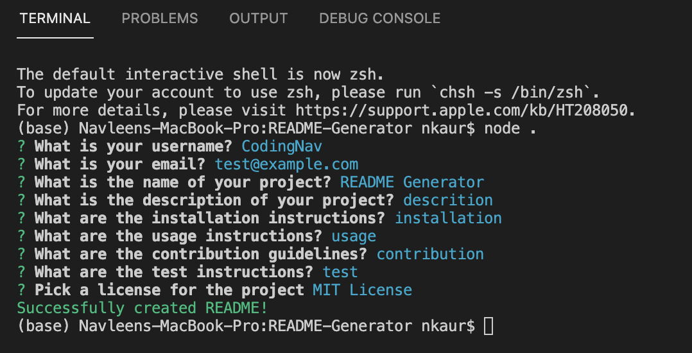
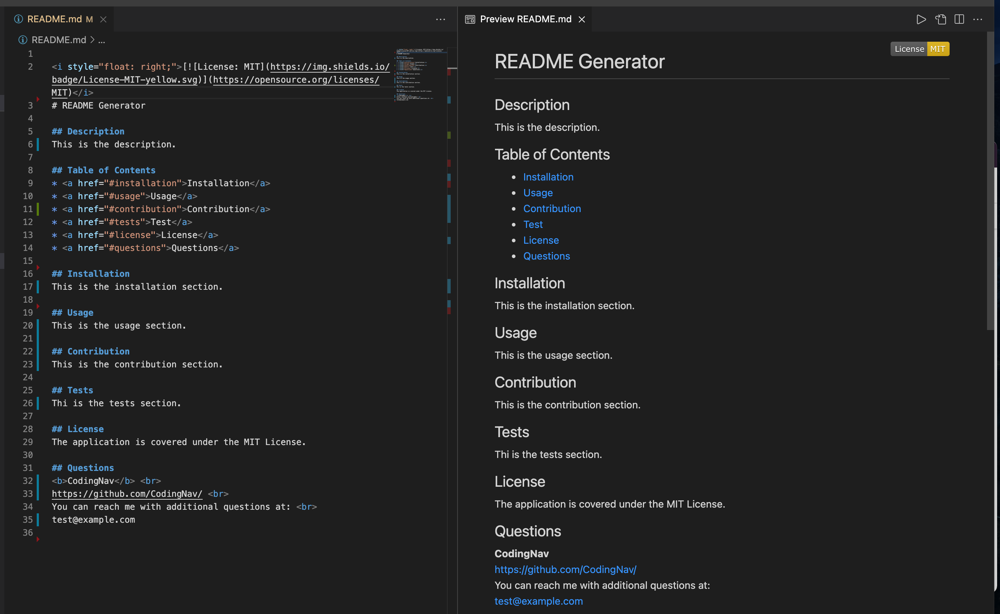

<i style="float: right;">[](https://opensource.org/licenses/MIT)</i>
​
# README Generator
​
## Table of Contents
* <a href="#description">Description</a>
* <a href="#preview">Preview</a>
* <a href="#installation">Installation</a>
* <a href="#usage">Usage</a>
* <a href="#license">License</a>
* <a href="#questions">Questions</a>
* <a href="#technologies">Technologies</a>
​
## Description
<b>README Generator</b> is a command-line application that accepts user input and generates a professional README for a new project.
​
## Preview
&nbsp; &nbsp; &nbsp;

https://user-images.githubusercontent.com/58195156/128802848-a526d0e3-bb86-4a04-988d-85e1c298cebc.mov

## Getting Started
These instructions will get you a copy of the project up and running on your local machine to be able to create your own READMEs easily.
​
### Prerequisites
* CMD Terminal
* GitBash(Optional)
* Node Js
​
## Installation
* On this page, click on the "clone or download" button. At the bottom of the drop down click the "Download Zip" button.
​
* Open up the "README-Generator" file in a command terminal.
​
* Use "npm install" to install all required dependencies for the app.
```
npm install
```
​
* Use "node index.js" in the command line within your terminal to run the application.
```
node index.js
```
​
## Usage
Used to quickly and easily create ReadMe files.
​
## License
The application is covered under the MIT License.
​
## Questions
<a href="https://github.com/CodingNav/"><b>CodingNav</b></a>
<br>
You can reach me with additional questions at: 
<br>
navleenkaurr@gmail.com
​
## Technologies
​
 &nbsp; &nbsp; &nbsp;

